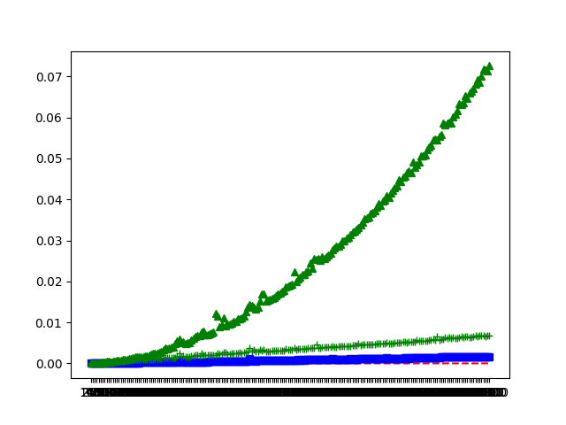

## Anagrams Benchmarks

Python 3.x is required to run this benchmark.

```sh
$ pip install -r requirements.txt
$ make
```

Three methods are compared:
* Using Counters
* Using C arrays instead of Counters
* Using [prime numbers](https://twitter.com/fermatslibrary/status/988399621402656773)

The last method, although elegant, is really slow because of arbitrary precision
integer multiplication. The two first methods are linear in the size of the
input string (with a difference probably being a constant factor).

Current results:

